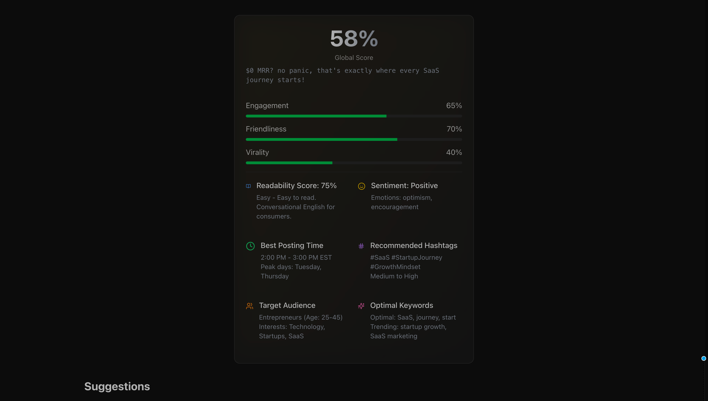

# X Post Analyzer

A modern web application that analyzes your X (Twitter) posts using AI to provide engagement, friendliness, and virality scores, along with suggestions for improvement. Built with Next.js and OpenAI.



## ✨ Features

- 🔍 AI-powered post analysis
- 📊 Detailed scoring for engagement, friendliness, and virality
- 💡 Smart suggestions for better posts
- 🎉 Confetti celebration for good scores
- 🎨 Clean and modern UI with dark theme
- ⚡ Instant results with no sign-up required
- 🔒 Secure API key management (stored in browser cookies)

## 🚀 Getting Started

### Prerequisites

- Node.js 18.17 or later
- pnpm (recommended) or npm
- OpenAI API key (you'll be prompted to enter it when you first use the app)

### Installation

1. Clone the repository:

   ```bash
   git clone https://github.com/audiencon/x-post-analyzer.git
   cd xposts
   ```

2. Install dependencies:

   ```bash
   pnpm install
   ```

3. Start the development server:

   ```bash
   pnpm dev
   ```

4. Open [http://localhost:3000](http://localhost:3000) in your browser

5. When you first use the app, you'll be prompted to enter your OpenAI API key. This key is securely stored in your browser's cookies and never sent to any server other than OpenAI's.

## 🛠️ Tech Stack

- **Framework**: Next.js 15 (App Router)
- **Language**: TypeScript
- **Styling**: Tailwind CSS
- **UI Components**: shadcn/ui
- **AI**: OpenAI API
- **State Management**: React Hooks
- **Animations**: Framer Motion
- **Package Manager**: pnpm

## 📁 Project Structure

```
src/
├── actions/               # Server actions and API handlers
│   └── analyze.ts         # OpenAI API integration
├── app/                   # Next.js app directory
│   └── page.tsx           # Main page component
├── components/            # React components
│   ├── analyze/           # Analysis components
│   │   ├── analyze-form.tsx    # Main analysis form
│   │   ├── scores-card.tsx     # Score display component
│   │   └── suggestions-grid.tsx # Suggestions display
│   ├── api-key-dialog/    # API key management
│   │   └── api-key-dialog.tsx  # API key input dialog
│   └── ui/                # Reusable UI components
│       ├── button.tsx     # Button component
│       ├── textarea.tsx   # Textarea component
│       └── progress.tsx   # Progress bar component
├── lib/                   # Utility functions and helpers
├── public/                # Static assets
│   └── screenshot.png     # Project screenshot
└── types/                 # TypeScript type definitions
    └── analyze.ts         # Analysis result types
```

## 🤝 Contributing

Contributions are welcome! Here's how you can help:

1. Fork the repository
2. Create your feature branch (`git checkout -b feature/amazing-feature`)
3. Commit your changes (`git commit -m 'Add some amazing feature'`)
4. Push to the branch (`git push origin feature/amazing-feature`)
5. Open a Pull Request

### Development Guidelines

- Follow TypeScript best practices
- Use meaningful commit messages
- Keep the code clean and well-documented
- Test your changes before submitting
- Update documentation as needed

## 📝 License

This project is licensed under the MIT License - see the [LICENSE](LICENSE) file for details.

## 🙏 Acknowledgments

- [Next.js](https://nextjs.org/) for the amazing framework
- [OpenAI](https://openai.com/) for the AI capabilities
- [shadcn/ui](https://ui.shadcn.com/) for the beautiful components
- [Framer Motion](https://www.framer.com/motion/) for the smooth animations

## 📞 Support

If you encounter any issues or have questions, please [open an issue](https://github.com/audiencon/x-post-analyzer/issues) on GitHub.

---

Made with ❤️ by [Audiencon](https://github.com/audiencon)
